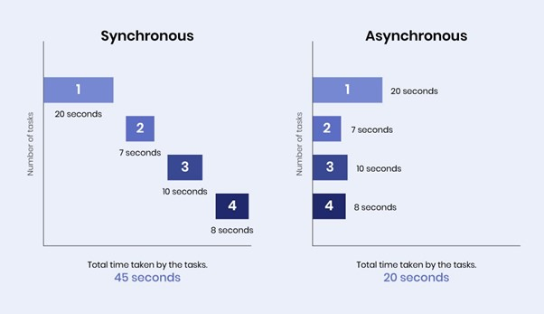

# Asynchronous vs Synchronous

- Programming languages are either `synchronous` or `asynchronous`.

Synchronous languages are where `tasks are performed one at a time`. You `need to wait for a task to finish` before moving on.E.g: C, C++, Java, and Python.

Asynchronous languages `allow you to move on to another task` before the previous one finishes. E.g: JavaScript (Node.js), Python's (asyncio) introduced in 3.4, Go (or Golang), Rust.

This is something we have to deal with in JavaScript (as it is asynchronous)

Because some things take time!

## Callback vs Promises vs Async Await

### Asynchronus:

Imagine we go to a restaurant, a waiter comes to a table, takes your order and gives it to the kitchen. Then they move on to the server on another table, while the chef is preparing the meal So the same person can serve the many different tables. The table has to wait for the chef to cook one meal before they serve another table. This is what we called asynchronous or non-blocking architecture. Here the waiter is like a thread allocated to handle requests. So a single thread is used to handle multiple requests.

### Synchronous:

So back to the restaurant example, imagine you go to another restaurant and in this restaurant, a waiter is allocated to you. He takes your order and gives it to the kitchen. Now he is sitting in the kitchen waiting for the chef to prepare your meal and this time he is not doing anything else he is just waiting for he is not going to take any order from another table until your meal is ready. This is what we called synchronous.

So when a program is being executed synchronously, the thread will wait until the first statement is finished to jump to the second one, while in asynchronous execution, even if the first one was not completed, the execution will continue.

- When a task is executed `synchronously`, it means that `each task will have to be fully completed before moving on to the next task`.

- When it is executed `asynchronously`, it means that the `program can move onto another task before the other one is finished`. The execution of the asynchronous task will not affect the execution of the overall program.



There are different ways to handle the async code. Those are callbacks, promises, and async/await.

### Promises

A promise in JavaScript is similar to a promise in real life. When we make a promise in real life, it is a guarantee that we are going to do something in the future. Because promises can only be made for the future.

A promise has two possible outcomes: it will either be kept when the time comes, or it won?t.

A promise is used to handle the asynchronous result of an operation. JavaScript is designed to not wait for an asynchronous block of code to completely execute before other synchronous parts of the code can run. With Promises, we can defer the execution of a code block until an async request is completed. This way, other operations can keep running without interruption.

What are promises?
Promises represent eventual results of an asynchronous operation.
"A Promise is an object representing the eventual completion or failure of an asynchronous operation" It's an object that may produce a single piece of data at some point in the future.
Either a resolved value Or a rejection (an error that tells us why it wasn't resolved).

#### States and Fates

Promises have three mutually exclusive potential states:

`Fulfilled`: The action relating to the promise succeeded.

`Rejected`: The action relating to the promise failed.

`Pending`: Hasn't fulfilled or rejected yet.

We say that a promise is `settled` if it isn't pending

##### Some Terminology

Executor: A function that contains the producing code.

Fulfilled: Succeeded.

Rejected: Failed.

Pending: Waiting.

Settled: Not pending.

Resolved: Finished.

Unresolved: If trying to resolve or reject will make an impact.

Thenable: A piece of data that is promise-like (it has a `.then` method).

#### To create a promise:

Firstly, we use a constructor to create a Promise object. The promise has two parameters, one for success (resolve) and one for fail (reject):

Let's create a promise:

```js
const myFirstPromise = new Promise((resolve, reject) => {
  const condition = true;
  if (condition) {
    setTimeout(function () {
      resolve("Promise is resolved!"); // fulfilled
    }, 300);
  } else {
    reject("Promise is rejected!");
  }
});
```

In the above Promise If Condition is `true`, resolve the promise returning the `Promise is resolved` , else return an error `Promise is rejected`. Now we have created our first Promise, Now let's use it.

#### Using Promise:

```js
myFirstPromise
  .then((successMsg) => {
    console.log(successMsg);
  })
  .catch((errorMsg) => {
    console.log(errorMsg);
  });
```

## Async, Await

`Async`/`await` lets us write asynchronous code as if it were synchronous. This is especially helpful for avoiding callback hell when executing multiple async operations in sequence--a common scenario when working with Mongoose. Each of the three functions below retrieves a record from the database, updates it, and prints the updated record to the console.

The keyword `async` before a function makes the function return a promise:
The keyword `await` makes JavaScript wait until that promise settles and returns its result.

#### Example

```js
async function asyncSample() {
  let promise = new Promise((resolve, reject) => {
    setTimeout(() => resolve("done!"), 1000);
  });
  // wait until the promise resolves (*)
  let result = await promise;
  console.log(result);
}

asyncSample();
```

Adding the keyword `async` to a JavaScript function automatically causes it to return a native JavaScript promise.

# DOM

The DOM stands for Document Object Model.
When we send HTML to a browser, like we did with our mini Hawkins site, the browser renders the HTML (displays it in a window) and it also creates a giant object that represents the web page. If you are a fan of Stranger Things, you could almost think of the DOM as The Upside Down, a parallel world that is only visible to some (and also, not evil).

As web developers, we can interact with this object (DOM) and we can make changes to the DOM, the browser will then redraw the web page to reflect the changes we made to the DOM.

To access the HTML elements:

```js
document.body.children[1].children[0].innerText;
```

This way of accessing elements in the document requires a LOT of typing and always mapping out your web page. And if you change anything one around on your page, the route will likely break (great example of fragile code). So if you moved the h2 element above the image it would be

Instead of hard-coding our access to different elements, the browser has some built in methods to find the element we are looking for. It's called `querying`

So we can query the `document` for the `h1` element and change the text inside (referred to as a key-value property of `innerText`) this element. When we change it in the DOM it will also update the browser view.

```js
document.querySelector("h1").innerText = "Welcome to the Upside Down";
```

### DOM Manipulation

- JavaScript was built to manipulate the DOM.
- Early JavaScript was challenging to use for complex projects, and although all the basic functionality was built in, creating solutions could be verbose and clunky.

- JavaScript has been changing and a lot of better functionality has been built in. Some people would argue that now 'vanilla' JavaScript is a superior solution over jQuery. My personal opinion: use the right tools for the job.

#### Querying and storing the queried element

It is a common pattern to query for an element and then store it in a variable for reuse

- Let's query for the image

```js
const image = document.querySelector("img");
```

Instead of querying over and over again, we now have our image stored in a variable. Let's console.log it!

```js
console.log(image);
```

#### Changing CSS with JavaScript

Sometimes you want to add or remove a class to change the appearance. Sometimes you want to do it inline with JavaScript - for now let's do it inline:

We can now manipulate our image:

Let's make it disappear!

`image.style.display = 'none'`

Let's make it reappear!

`image.style.display = 'block'`

Let's make it black and white

`image.style.filter = 'grayscale(100%)'`

Finally, let's make it color again

`image.style.filter = ''`

There are tons of different things you can do. The important thing to note is how easy it is to reuse a queried element and manipulate it when you store it to a variable.

#### Creating an element

We can create a new element

```js
let newImg = document.createElement("img");
```

Although we created the element, we haven't appended it anywhere to the DOM.

Lets append it to the class `container`

```js
document.querySelector(".container").appendChild(newImg);
```

#### Set an attribute

Many elements have attributes, you can add, edit and remove them using JavaScript as well.

```js
newImg.setAttribute(
  "src",
  "https://img.freepik.com/free-photo/purple-osteospermum-daisy-flower_1373-16.jpg"
);
```

#### Remove an element

Getting rid of an element is easy!

```js
newImg.remove();
```

- **Search**

  - document.querySelector() - Returns the first objects, that matches the css style selector
    document.querySelector("p.intro");
  - document.querySelectorAll() - Returns all the objects, that matches the css style selector
    document.querySelectorAll("p.intro");
  - document.getElementById() - Returns element with specific id
    document.getElementById("demo")
  - document.getElementsByClassName() - Returns list of all elements belong to the specified class
    document.getElementsByClassName("intro");
  - document.getElementsByName() - Returns elements by Name
  - document.getElementByTagName() - Returns elements by tag name  
    const element = document.getElementsByTagName("p");

  In JavaScript, document.write() can be used to write directly to the HTML output stream:
  <script>
  document.write(Date());
  </script>

- **Creation**
  - document.createElement()
  - node.style
- **DOM editing**
  - node.appendChild()
  - node.removeChild()
  - node.innerText
  - node.setAttribute()
  - node.innerHTML
  - node.id
  - node.classList
- **Traversal**
  - node.childNodes
  - node.children
  - node.firstChild

You might be asking: what is a **node**?

A node is the generic name for any type of object in the DOM hierarchy. A node could be one of the built-in DOM elements such as document or document.body, it could be an HTML tag specified in the HTML such as `<input>` or `<p>` or it could be a text node that is created by the system to hold a block of text inside another element. So, in a nutshell, a node is any DOM object.

Information about nodes was gathered from [here](https://stackoverflow.com/questions/9979172/difference-between-node-object-and-element-object)

# DOM Events

## JavaScript Events

So far, the only way we've been able to interact with the applications we've
built so far is through the REPL in the browser. It's too much for us to ask our
users to do the same! So, instead, we want to build applications that respond to
our user's input: a user clicks a button, triggering an action in our
application.

We've learned HTML and CSS, the tools we need to built out the interface; we've
also learned JavaScript, the programming language we can use to build programs;
now, we need to bring the two together and build interfaces (using HTML and CSS)
with functionality our users can leverage (using JavaScript).

The **DOM** not only lets us manipulate the document (or webpage) using
JavaScript, but also gives us the ability to write JavaScript that responds to
interactions within the page. These interactions are communicated as **events**.

We can **listen** for certain kinds of user-driven events, such as clicking a
button, entering data into a form, keypresses and many, many more.

> You can find information on events and examples at the
> [Mozilla Developer Network](https://developer.mozilla.org/en-US/docs/Web/Events).

"DOM Events are sent to notify code of interesting things that have taken
place." _- MDN_

For the time being, when we talk about "interesting things that have taken
place" we are talking about user interactions with the page. In the context of
JavaScript and building web pages, we are talking about listening for events on
DOM elements and triggering some action in response to those events.

## Types of Events

Let's start by answering the question, "What kinds of events can we respond to?"
There are many events that we can listen for and respond to in JavaScript.
Broadly speaking, we can divide these events in to four categories:

### 1. Document / Window Events

- load
- resize
- unload

### 2. Mouse Events

- click
- dblclick
- mouseenter
- mouseleave

### 3. Key Events

- keypress
- keydown
- keyup

### 4. Form Events

- submit

HTML events are "things" that happen to HTML elements.

When JavaScript is used in HTML pages, JavaScript can "react" on these events.

HTML Events
An HTML event can be something the browser does, or something a user does.

Here are some examples of HTML events:

An HTML web page has finished loading
An HTML input field was changed
An HTML button was clicked
Often, when events happen, you may want to do something.

JavaScript lets you execute code when events are detected.

HTML allows event handler attributes, with JavaScript code, to be added to HTML elements.

Here is a list of some common HTML events:

Event Description
onchange - An HTML element has been changed.
onclick - The user clicks an HTML element.
onmouseover - The user moves the mouse over an HTML element.
onmouseout - The user moves the mouse away from an HTML element.
onkeydown - The user pushes a keyboard key.
onload - The browser has finished loading the page.

#### JavaScript Event Handlers

Event handlers can be used to handle and verify user input, user actions, and browser actions:

Things that should be done every time a page loads
Things that should be done when the page is closed
Action that should be performed when a user clicks a button
Content that should be verified when a user inputs data
And more ...
Many different methods can be used to let JavaScript work with events:

HTML event attributes can execute JavaScript code directly
HTML event attributes can call JavaScript functions
You can assign your own event handler functions to HTML elements
You can prevent events from being sent or being handled.

## Event Listeners in JavaScript

When we want to respond to events in JavaScript, we do so in two parts:

1. We set up an event listener with `.addEventListener`
1. We define an event handler, a callback function that get's passed to
   `.addEventListener`

### Step 1: Event Listener

In order to listen for an event, we need to define an **event listener**. Below
you'll find a simple event listener associated with a `'click'` event on a
`button` element.

First we target the button:

<details>
  <summary>If a button element has a class of `.js-button`, how would we capture this from the DOM?</summary>

```js
const button = document.querySelector(".js-button");
```

</details>

Once we have the element from the DOM, we can tell JS to listen for an event:

```js
// This is the event listener

button.addEventListener("click", handleClickEvent);

// first argument: event, as a string
// second argument: callback function for our event handler
```

That completes step 1 of working with events - we're now listening for a click
event on our button!

### Step 2: Event Handler

For step two, we need to define the function that will be called whenever this
event is emitted. This is just a function, but it has a special name due to how
it's being used: a **callback** function:

```js
function handleClickEvent() {
  console.log("I was clicked!");
}
```

All together, our code looks like this:

```js
const button = document.querySelector(".js-button");

button.addEventListener("click", handleClickEvent);

function handleClickEvent() {
  console.log("I was clicked!");
}
```

You will most often see (and probably use) an anonymous callback function for
your event handler. That looks like this:

```js
const button = document.querySelector(".js-button");

button.addEventListener("click", function () {
  console.log("I was clicked!");
});
```

<details>
  <summary>What is this code doing?</summary>

The code above first gets an element from the DOM. It then attaches an event
listener to that <code>button</code> element with the
<code>addEventListener()</code> method. The <code>addEventListener()</code>
method takes two arguments:

<ol>
  <li>the event we want to listen for, and</li>
  <li>the function that should be called whenever that event is invoked.</li>
</ol>

In the case of the code above, we're saying we want to listen for
<code>click</code> events on our <code>button</code>, and whenever someone does
click on our button, call the <code>handleClickEvent()</code> function.

</details>

### Reference

- [Callbacks](https://www.w3schools.com/js/js_callback.asp)

- [Promises](https://developer.mozilla.org/en-US/docs/Learn/JavaScript/Asynchronous/Promises)

- [Async](https://www.w3schools.com/js/js_async.asp)

- [DOM Events](https://www.w3schools.com/jsref/dom_obj_event.asp)

- [JS Events](https://www.javatpoint.com/javascript-events)
