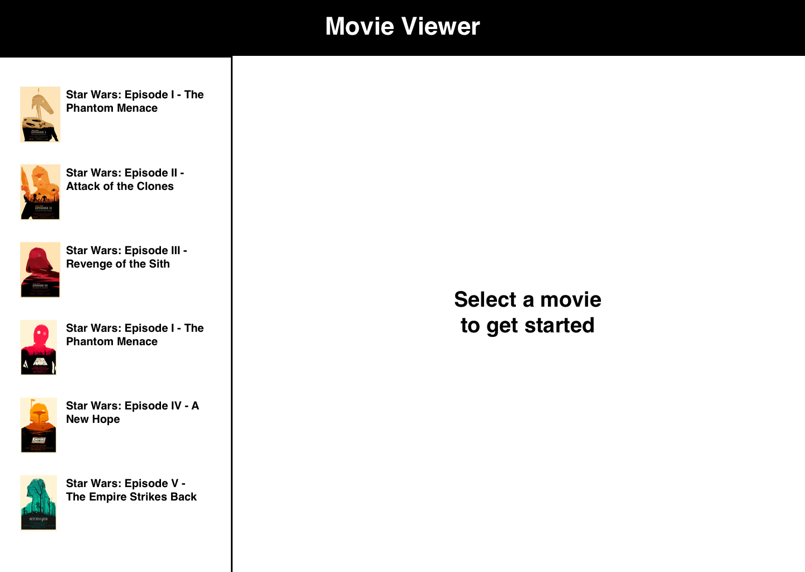
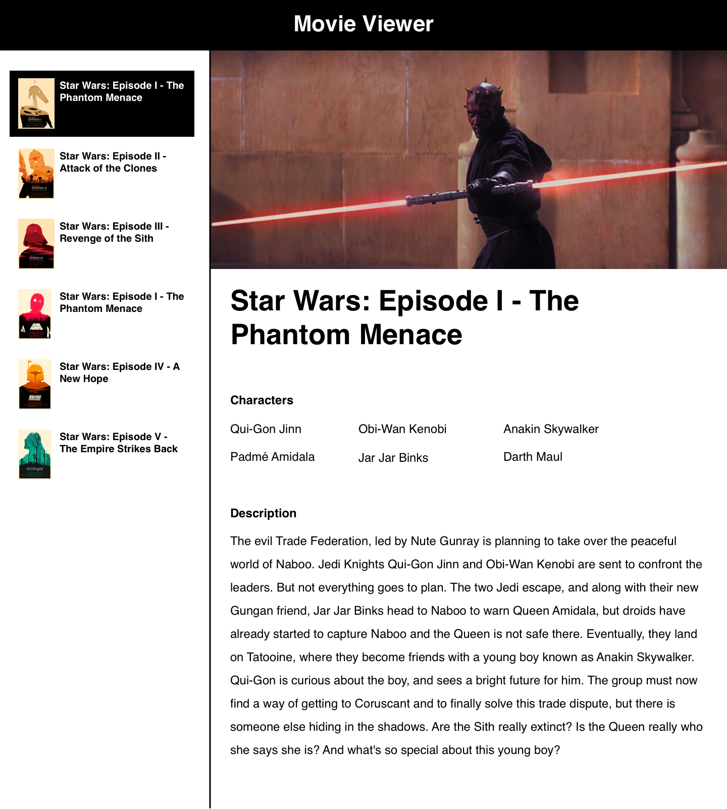

# React Movie Viewer
Build a movie details viewer using React and React Router

## Instructions
1. Create a react app in this directory (`movie-viewer`) using the command
`npx create-react-app .`
1. Remove any unecessary files.
1. Install React router using `npm i react-router-dom`.
1. Move `data.json` into the `src` folder once your React app is scaffolded.
1. Meet the requirements below.

## Requirements
Using React and React Router, build a simple website showcasing the details for
all the Star Wars Movies. Your app will have a sidebar, listing all the Star Wars
movies and linking to a show page in the main section of the page. When a user
clicks on a movie from the sidebar list, they should see the details for that
movie rendered in the main content area of the page. Use the data provided in
`data.json`.

